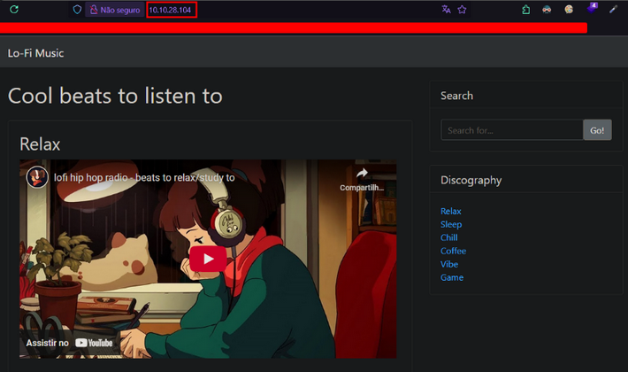

 

  

### Lo-Fi  

Want to hear some lo-fi beats, to relax or study to? We've got you covered!  

**CTF Lo-Fi TryHackMe by Karina.**  

[https://tryhackme.com/room/lofi](https://tryhackme.com/room/lofi)

## Task: 
🇺🇸 Navigate to the following URL: `http://MACHINE_IP` and find the flag in the root of the filesystem.  
🇧🇷 Navegue até a seguinte URL: `http://MACHINE_IP` e encontre a bandeira na raiz do sistema de arquivos.
##

🇺🇸 Index page: / 🇧🇷 Página Inicial: 

  

🇺🇸 If we click on any link in right side, we can see that URL can change dynamically.  
🇧🇷 Se clicarmos em qualquer link do lado direito, podemos ver que a URL muda dinamicamente. 

  

🇺🇸 ☝️🤓 Let's try to access root of the filesystem on the server, using this common path: `../../../../etc/passwd`  
🇧🇷 ☝️🤓 Vamos tentar acessar a raiz do sistema de arquivos no servidor usando  esse caminho comum: `../../../../etc/passwd` 

  

🇺🇸 🤩 Yey! We found something! ☝️🤓 This means we can try to find our flag by manipulating the server URL. Let's try access something like `flags.txt`, sounds obvious, right? 🤨  

🇧🇷 🤩 Isso! Encontramos algo! ☝️🤓 Isso significa que podemos tentar encontrar nossa bandeira manipulando a URL do servidor. Vamos tentar acessar algo como `flags.txt`, parece óbvio, né? 🤨  

  

🇺🇸 😳 What?! 😭 It was obvious at all! There it is! 🥳 We found our flag at `../../../../flag.txt`!  
🇧🇷 😳 Quêêê?! 😭 Era óbvio mesmo! Tá aí! 🥳 Encontramos nossa bandeira em `../../../../flag.txt`!
 

  

*Made with 💜 by Karina.*  

