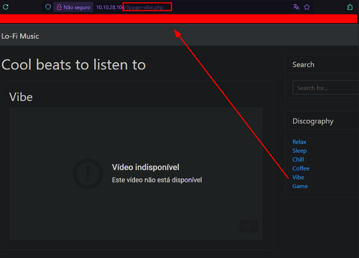
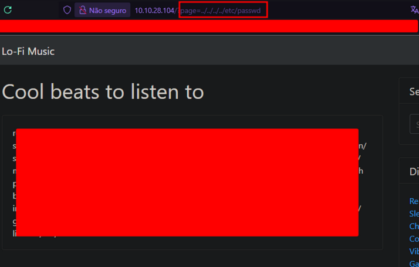
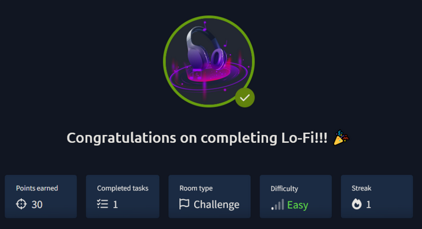

 

<table style="width:100%; table-layout:fixed;">
  <tr>
    <td rowspan="2" style="width:20%;">
      
    </td>
    <td>
      
Want to hear some lo-fi beats, to relax or study to? We've got you covered!

    </td>
  </tr>
  <tr>
    <td>
      
<strong>Write Up CTF Lo-Fi TryHackMe by <a href="https://karinagante.github.io/" target="_blank" rel="noopener noreferrer">Karina Gante</a>.</strong>

    </td>
  </tr>
</table>

##

### Access room here:

👉 [https://tryhackme.com/room/lofi](https://tryhackme.com/room/lofi)

----

### Task: 

Navigate to the following URL: <code>http://MACHINE_IP</code> and find the flag in the root of the filesystem.

----

### Recon:

If we click on any link in right side, we can see that URL can change dynamically:

##

 May we could try to access root of the filesystem on the server, using common paths like: <code>../../../../etc/passwd</code>

##

 It seems like we found something! Now, we can try to find our flag by manipulating the server URL. Let's try access some flag file, like <code>flags.txt</code>, sounds obvious, right? 🤨

##

 😳 What?! 😭 It was obvious at all! There it is! 🥳 We found our flag at <code>../../../../flag.txt</code>!

----

*Flag Discovered with💜 by [Karina Gante](https://karinagante.github.io/).* 

##

*Official Member of [CVE-Hunters](https://www.cvehunters.com/)🏹*